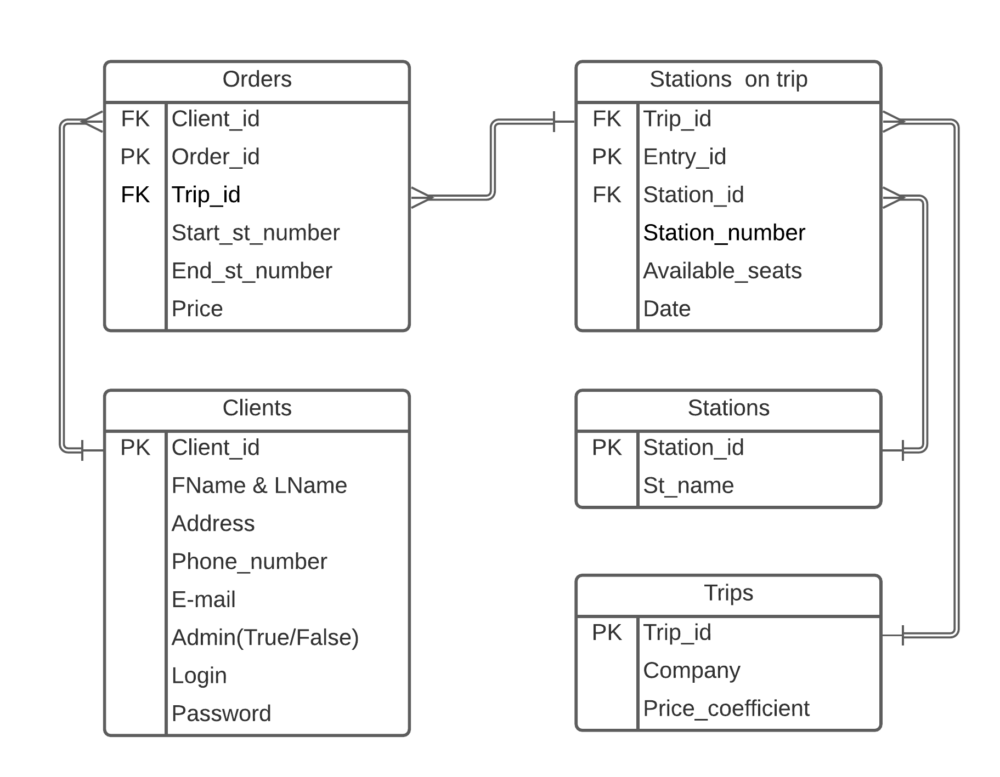

CMC MSU Web-technology practical work
=============

# Система информации об автобусных рейсах и билетах

## Описание страниц

### Общее
---
- В верхнем меню присутствует кнопка "Мои билеты" для перехода на страницу с купленными билетами.
- В верхнем меню присутствует кнопка "Администрирование" для перехода на страницу администратора.
- В верхнем меню присутствует кнопка "Главная" для перехода на главную страницу.
- В верхнем меню присутствует кнопка "Регистрация" для перехода на страницу с регистрацией.
- В верхнем меню присутствует кнопка "Вход" для перехода на страницу с входом.

### Вход
---
1. Ввод логина и пароля для входа.

### Регистрация
---
1. Ввод персональных данных пользователем для регистрации в системе.

### Главная
---
1. Выбор рейса для поездки. Фильтр с различными парамтерами: 
   - Станция отправления 
   - Станция прибытия
   - Дата
   - Ценовой диапазон
   - Компания

2. Кнопка "Поиск" для перехода на страницу с предложениями.

### Предложения
---
1. Где-нибуль в начале указаны фильты, введенные ранее.
2. Список предложенных рейсов в соотвествии с фильтрами, заданными ранее. Для каждого рейса указаны:
   - ID записи
   - Дата отправления и прибытия
   - Время в пути
   - Цена
   - Компания рейса
   - Количество свободных мест
3. У каждого предложения есть кнопка "Купить билет" для перехода на страницу с офромлением(подтвреждением) заказа.
4. Возможности сортировки по дате, стоимости, названию компании, кол-ву свободных мест.

### Подтвеждение заказа
---
0. Если пользователь не выполнил вход, то перенаправление на страницу входа.
1. Представлена вся информация о заказе, предложены доп. услуги.
2. Кнопка "Другие предложения" для возвращения на станицу с предложениями.
3. Кнопка "Подтвердить" для занесения заказа в базу данных.

### Мои билеты
---
0. Если пользователь не выполнил вход, то перенаправление на страницу входа.
1. Список заказов клиента. Для каждой позиции указаны:
   - ID записи
   - Дата отправления и прибытия
   - Время в пути
   - Цена покупки
   - Компания рейса
3. У каждого заказа есть возможность его удаления.

### Страница администратора
---
0. Если пользователь не выполнил вход, то перенаправление на страцицу входа.
1. Переход на страницу с клиентами или с рейсами.

### Клиенты
---
1. Список всех клиентов. Для каждого клиента указаны:
   - ID записи
   - FName & LName
   - Номер телефона
2. У каждого клиента есть кнопка "Информация о клиенте", для перехода на страницу с полной информацией.
3. Кнопка "Добавить" для добавления нового клиента.

### Информация о клиенте
---
1. Полная информация о клиенте, с историей заказов и возможностью редактирования:
   - Удалить клиента
   - Измененить персональные данные клиента
2. Инфорамция включает в себя:
   - FName & LName
   - Номер телефона
   - E-mail
   - Адрес
   - История заказов клиента. Устроена так же, как и на странице "Мои билеты"

### Добавление нового клиента
---
1. Заполнение формы с данными о новом клиенте:
   - FName & LName
   - Address
   - Phone_number
   - E-mail
   - Admin(True/False)
   - Login
   - Password
2. Кнопка "Подтвердить" для отправки информации в БД.

### Рейсы
---
1. Список всех рейсов. Для каждого рейса указаны:
   - ID записи
   - Дата отправления и прибытия
   - Цена
   - Компания рейса
2. У каждого рейса есть кнопка "Информация о рейсе", для перехода на страницу с полной информацией.
3. Кнопка "Добавить" для добавления нового рейса.

### Информация о рейсе
---
1. Полная информация о рейсе, с возможностью редактирования:
   - Измененить даты рейса
   - Изменить коэффицинет наценки компании за каждую остановку на данном рейсе
   - Удалить/добавить некоторые промежуточные остановки
2. Инфорамция включает в себя:
   - Список всех остановок с указанием даты прибытия на каждую из них
   - Коэффицинет наценки компании за каждую остановку на данном рейсе
   - Компания рейса
   - Список всех клинетов, зарегистрированных на рейс. Устроен так же, как и на странице "Клиенты"

### Добавление нового рейса
---
1. Заполнение формы с данными о новом рейсе:
   - Компания
   - Остановки с датами и кол-вом мест
   - Коэффицинет наценки компании за каждую остановку на данном рейсе
2. Кнопка "Подтвердить" для отправки информации в БД.

## Сценарии использования

- Заказ билета
  - "Главная": Задать параметры, Кнопка "Поиск" -> Страница "Предложения": Выбор билета, кнопка "Купить билет" -> Страница "Подтверждение заказа": Кнопка "Подтведить".
- Получение истории заказов клиента
  - "Главная": кнопка "Администрирование" -> Страница "Клиенты": выбор клиента, кнопка "Информация о клиенте" -> "Информация о клинете": Тут история заказов
- Получение списка клиентов, ехавших определенным рейсом
  - "Главная": кнопка "Администрирование" -> Страница "Рейсы": выбор рейса -> "Информация о рейсе"
- П
олучение списка рейсов по датам, направлениям и промежуточным остановкам, информации о ценах билетов и наличии свободных мест
  - См. сценарий "Заказ билета"
- Удаление рейса, чтение и редактирование данных о нем
  - "Главная": кнопка "Администрирование" -> Страница "Рейсы": выбор рейса -> "Информация о рейсе": редактирование
- Удаление клиента, чтение и редактирование данных о нем
  - "Главная": кнопка "Администрирование" -> Страница "Клиенты": выбор клиента, кнопка "Информация о клиенте" -> "Информация о клинете": редактирование.
- Добавление клиента
  - "Главная": кнопка "Администрирование" -> Страница "Клиенты": выбор клиента, кнопка "Добавить" -> Заполнение страницы с формой -> Кнопка "Подтвердить"
- Добавление рейса
  - "Главная": кнопка "Администрирование" -> Страница "Рейса": выбор клиента, кнопка "Добавить" -> Заполнение страницы с формой -> Кнопка "Подтвердить"

## БД

## Описание БД

### Таблица Clients
---
- client\_id - первичный ключ
- admin - является ли клиент также администратором

### Таблица Orders
---
- client\_id - внешний ключ
- order\_id -  первичныйключ
- trip\_id - внешний ключ
- start\_st\_number - Порядковый номер станции отправления на данном рейсе
- end\_st\_number - Порядковый номер станции прибытия на данном рейсе
- price - Стоимость поездки, расчитываемая по формуле для простоты: (End\_st\_number- Start\_st\_number) * standart\_price * price\_cofficient

### Таблица Stations on trip
---
- trip\_id - внешний ключ
- entry\_id -  первичный ключ
- station\_id - внешний ключ
- station\_number - порядковый номер данной станции на соответсвующем рейсе.
- availible\_seats - кол-во свободных мест на данном рейсе на соответствующей станции.

### Таблица Stations
---
- st\_number - первичный ключ
- st\_name - название станции

### Таблица Trips 
---
- trip\_id -  первичныйключ
- company - название компании
- price\_coffecient - наценка компании за каждую остановку
